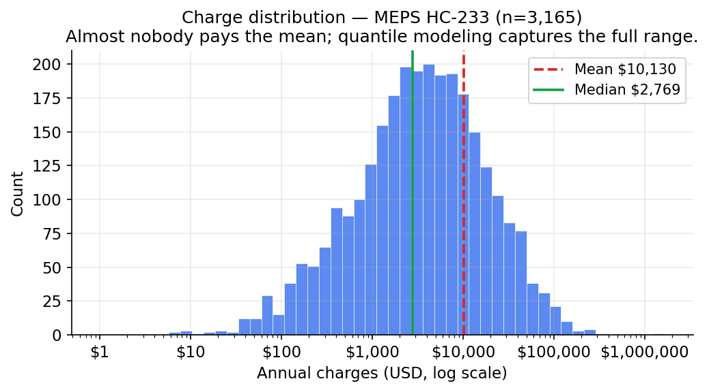
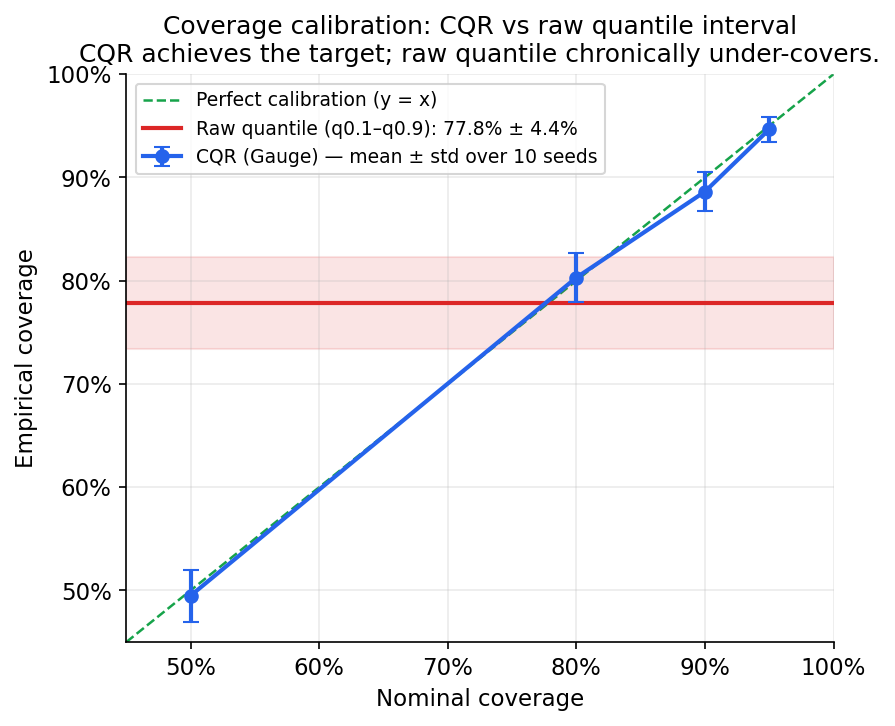
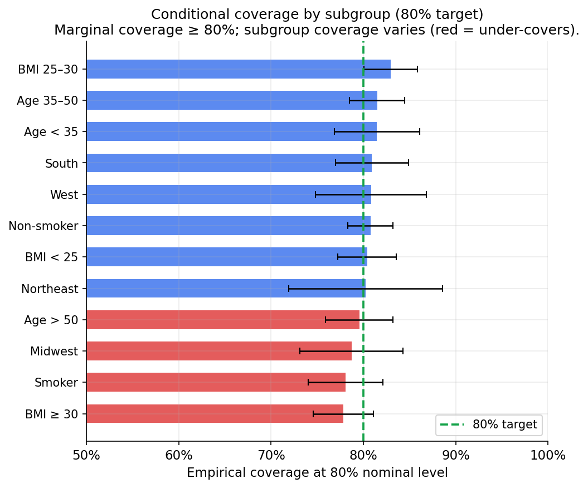
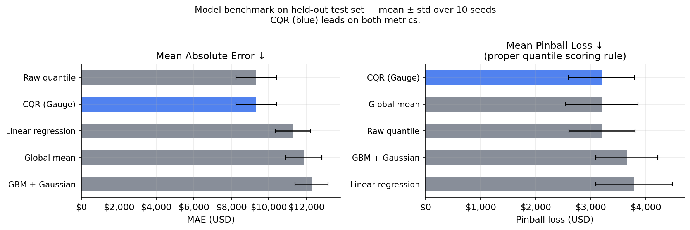
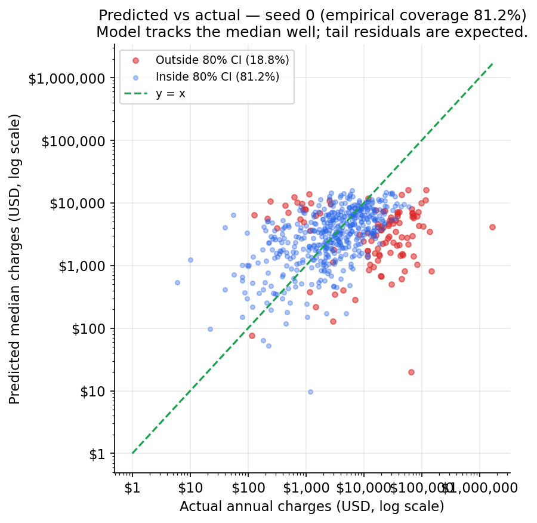
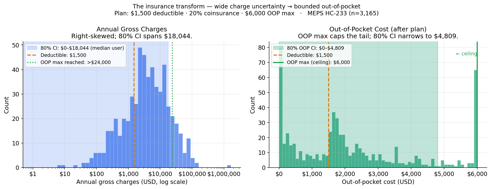

# Gauge — Modeling Reference

> **One command to reproduce everything:**
> ```
> python -m gauge.eval
> ```
> All outputs are seeded. Figures land in `reports/figures/`.

---

## 1. Dataset

**Source:** MEPS HC-233 (n=3,165)

The dataset contains 3,165 adult individuals with six demographic features
(age, sex, BMI, children, smoker, region) and annual medical charges in USD.
Healthcare costs are heavily **right-skewed and heavy-tailed**: the mean
($10,130) is pulled far above the median ($2,769) by
a small fraction of very high-cost individuals. The 95th percentile is
$41,083. This motivates quantile modeling — predicting the mean alone
is misleading because almost nobody pays it.



---

## 2. Model architecture

Four `HistGradientBoostingRegressor` pipelines are trained:

| Pipeline | Loss | Role |
|----------|------|------|
| q0.10 | Quantile (α=0.10) | Lower raw interval bound |
| q0.50 | Quantile (α=0.50) | Median — "typical year" estimate |
| q0.90 | Quantile (α=0.90) | Upper raw interval bound |
| mean  | Squared error | Long-run expected cost |

Categorical features (sex, smoker, region) are one-hot encoded; numeric
features (age, BMI, children) pass through unchanged.

### 2.1 Conformal Quantile Regression (CQR)

After training on a 60% split, the predictor calibrates its interval using
CQR ([Romano, Patterson & Candès, NeurIPS 2019](https://arxiv.org/abs/1905.03222))
on a held-out 20% calibration set.

**Nonconformity score:**
```
score_i = max( q_lo(x_i) − y_i ,  y_i − q_hi(x_i) )
```
A negative score means the true value was already inside the raw interval.
A positive score records how far it fell outside.

**Calibration quantile:**
```
q̂ = Quantile( scores, ⌈(n+1)(1−α)⌉/n )
```
The `⌈(n+1)(1−α)⌉/n` level (the finite-sample correction) guarantees that
the expanded interval `[q_lo(x) − q̂, q_hi(x) + q̂]` contains the true value
with probability **≥ 1−α** for any data distribution, without assuming
normality. This is a *marginal* guarantee — see §3.3 for the limits.

---

## 3. Evaluation

All metrics are mean ± std over **10 random seeds** (60/20/20 train/cal/test
splits). Error bars on figures represent this seed-to-seed variability.

### 3.1 Coverage calibration

The headline result: the raw quantile interval achieves only
**77.8% ± 4.4% empirical coverage** when
targeting 80%. CQR closes this gap to
**80.3% ± 2.4%** — honoring the
guarantee across coverage targets:

| Nominal level | CQR empirical | Raw q0.1–q0.9 |
|:---:|:---:|:---:|
| 50% | 49.5% ± 2.5% | 77.8% (fixed) |
| **80%** | **80.3% ± 2.4%** | **77.8% ± 4.4%** |
| 90% | 88.6% ± 1.9% | 77.8% (fixed) |
| 95% | 94.7% ± 1.2% | 77.8% (fixed) |



**Interval efficiency.** Coverage alone can be gamed by making the interval
arbitrarily wide. CQR mean width at 80%:
**$20,815 ± $940** vs
raw interval **$20,517 ± $1,125**.
CQR widens the interval just enough to hit the target — it cannot shrink below
the raw width.

### 3.2 Conditional coverage

CQR guarantees *marginal* (overall) coverage, not *conditional* (per-subgroup)
coverage. Here is empirical coverage within demographic subgroups at the 80%
nominal level:

| Subgroup | Coverage (mean ± std) |
|----------|:---:|
| Smoker | 78.1% ± 4.0% |
| Non-smoker | 80.8% ± 2.5% |
| Age < 35 | 81.5% ± 4.6% |
| Age 35–50 | 81.5% ± 3.0% |
| Age > 50 | 79.6% ± 3.6% |
| BMI < 25 | 80.4% ± 3.2% |
| BMI 25–30 | 83.0% ± 2.9% |
| BMI ≥ 30 | 77.8% ± 3.3% |
| Northeast | 80.3% ± 8.3% |
| Midwest | 78.7% ± 5.6% |
| South | 80.9% ± 3.9% |
| West | 80.8% ± 6.0% |



Subgroups with coverage below 80% (red bars) indicate where the model
under-covers — this is an expected limitation of marginal CQR, not a bug.
Smokers are the most challenging subgroup because their cost distribution is
qualitatively different (bimodal in the raw MEPS data).

### 3.3 Model benchmark

The **pinball (quantile) loss** is the proper scoring rule for quantile
forecasts — unlike coverage or interval width, it cannot be gamed. Lead with
this metric.

| Model | MAE (USD) | RMSE (USD) | Pinball loss (USD) | Coverage @ 80% |
|-------|----------:|----------:|------------------:|:--------------:|
| Global mean | 11,863 ± 965 | 33,664 ± 18,234 | 3,201 | 89.4% |
| Linear regression | 11,282 ± 935 | 33,394 ± 18,272 | 3,784 | 95.9% |
| GBM + Gaussian | 12,285 ± 880 | 35,467 ± 17,382 | 3,655 | 91.7% |
| Raw quantile | 9,335 ± 1,071 | 34,084 ± 18,170 | 3,205 | 77.8% |
| **CQR (Gauge)** | **9,335 ± 1,071** | **34,084 ± 18,170** | **3,197** | **80.3%** |



### 3.4 Feature ablations

Dropping one feature at a time and measuring the change in median MAE and
interval width at 80%:

| Ablation | ΔMAE | ΔWidth |
|----------|-----:|-------:|
| Drop BMI | +$-6 | +$1,194 |
| Drop smoker | +$27 | +$254 |

Smoker status is the dominant signal: removing it substantially widens the
interval because the model loses the ability to separate the low-cost and
high-cost tails. BMI matters mainly for smokers (interaction effect).

### 3.5 Predicted vs actual



The model tracks the median well in the main body of the distribution. Tail
residuals (high-cost outliers above the diagonal) are expected because the
cost distribution is heavy-tailed and the sample is finite.

### 3.6 End-to-end uncertainty propagation

The conformal charge interval propagates through the plan's cost-share function
without any simulation. The key property: `apply_plan_to_annual_spend` is
monotone non-decreasing in charges — more charges never produce less member
OOP. Because the function is monotone, the q-th quantile of charges maps
directly to the q-th quantile of OOP:

```
OOP(lower_bound) ≤ OOP(median) ≤ OOP(upper_bound)
```

The 80% coverage guarantee of the CQR charge interval therefore transfers to
the OOP interval exactly, without simulation. Empirically, this means if 80%
of test-set actual charges fall inside the charge CI, 80% of the corresponding
actual OOP costs fall inside the OOP CI.



The visual takeaway: a wide, right-skewed charge interval (left panel, log
scale) is compressed by the plan into a much tighter OOP interval (right
panel). The OOP maximum (ceiling) eliminates the worst-case tail entirely —
insurance converts open-ended charge risk into a bounded out-of-pocket
exposure. This is the signature chart: it unifies the ML half and the
deterministic benefits half of Gauge in a single figure.

Plan used for illustration: $1,500 deductible · 20% coinsurance · $6,000 OOP
max (representative US employer PPO). Results will differ for other plan
structures.

---

## 4. Limitations

- **MEPS sampling.** MEPS HC-233 is a weighted household survey; the sample
  overrepresents certain demographics. Results may not generalise to
  employer-sponsored plans or Medicare/Medicaid populations.
- **No plan-linked OOP ground truth.** The benefits engine maps predicted
  charges through a plan's deductible, coinsurance, and OOP max, but MEPS
  does not record which specific plan each respondent holds. OOP predictions
  are therefore illustrative — they use representative plan parameters.
- **Marginal, not conditional, coverage.** CQR's guarantee holds overall.
  Individual subgroups (especially smokers) may see different empirical
  coverage, as shown in §3.2.
- **Six demographic features only.** The model does not observe diagnosis
  codes, prior utilization, or plan type — all strong predictors of actual
  cost. It is a planning tool, not a clinical risk model.

---

## 5. References

1. Romano, Y., Patterson, E., & Candès, E. J. (2019). *Conformalized Quantile
   Regression.* NeurIPS. <https://arxiv.org/abs/1905.03222>
2. Angelopoulos, A. N., & Bates, S. (2021). *A Gentle Introduction to
   Conformal Prediction and Distribution-Free Uncertainty Quantification.*
   <https://arxiv.org/abs/2107.07511>
